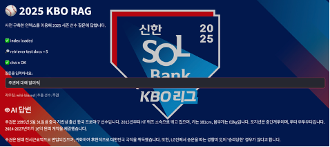
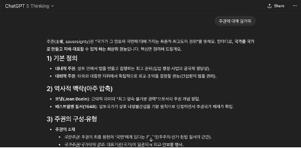
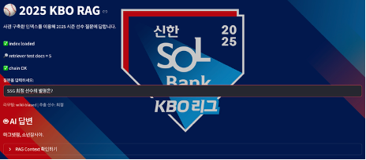
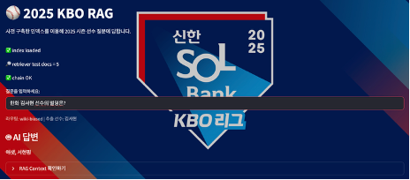
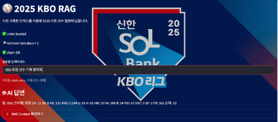

# 2025시즌 KBO 선수 기록 및 나무위키 문서 기반 RAG 시스템

> “정량(기록)”은 KBO 공식 기록 CSV, “정성(별명·서사)”은 나무위키 TXT를 결합한 **하이브리드 RAG**.
> **의도 라우팅**(정량 ↔ 정성)과 **선수 이름 부스팅/메타데이터 필터링**으로 동명이인·일반어 충돌을 줄이고, **로컬 맥북(MPS)** 환경에서도 빠르게 동작하도록 임베딩 캐시/직접 FAISS 빌드로 최적화했습니다. 

---

## 핵심 아이디어

* **하이브리드 문서 소스**

  * **정량**: 팀/연도별 KBO 시즌 기록 CSV(타자·투수) → 한글 질의(“성적/기록/타율/ERA…”)에 강함
  * **정성**: 나무위키 선수 문서 TXT → 별명, 별칭, 서사형 설명 등 비정형 질의에 강함
* **의도 라우팅(정량 vs 정성)**
  질의에 정량 키워드(성적/기록/스탯/타율/OPS/WAR/ERA/이닝/세이브 …)가 감지되면 **stats-only**(CSV 전용 리트리버), 그 외는 **wiki-biased**(위키 0.7 + 기본 0.3 앙상블)로 자동 전환. 
* **선수 이름 우선 전략**

  * 문서 전처리 시 **부스팅 헤더**를 주입: `passage: [KBO][야구][선수] 선수:최정 최정 팀:SSG …`
  * 검색 시 **metadata.player** 필터로 **정확한 선수 컨텍스트만 회수**
  * 효과: ‘주권(國家主權) vs 선수 주권’ 같은 동형이의어 충돌을 안정적으로 해소. 
* **로컬 친화 성능 최적화**

  * **임베딩 캐시(npz)** + **FAISS 직접 구성**으로 재임베딩 없이 빠른 인덱스 재생성
  * **MPS 가속**(Apple Silicon)과 대배치 인코딩으로 속도 개선

---

## 데모 시나리오(예시 질의)

* “**SSG 최정의 별명은?**” → 위키 중심 회수(‘마그넷정’, ‘소년장사’ 등)
* “**한화 김서현 선수의 성적은?**” → CSV 중심 회수(연도별 스탯)
* “**KT 주권에 대해 알려줘**” → 선수 ‘주권’으로 정확히 연결(국가 ‘주권’ 아님) 

---

## 저장소 구성

```
.
├─ kbo_app.py                 # Streamlit 앱(의도 라우팅 + 이름 필터 + 앙상블 리트리버)
├─ build_docs.py              # CSV/TXT → Document(jsonl) 생성(+ 선수명 사전 생성)
├─ build_index.py             # jsonl → 청크/임베딩 → FAISS 인덱스 저장(표준)
├─ learn_rag.py               # 실습/학습용 파이프라인(데모 스크립트)
├─ scrape_kbo_all_by_team.py  # KBO 공식 사이트 팀별 시즌 기록 크롤러
├─ scrape_namu_kbo_player.py  # 나무위키 선수 문서 크롤러
├─ txt_process.py             # 나무위키 TXT 정리(특수토큰/각주/공백 정규화 등)
├─ artifacts/
│  ├─ raw_docs.jsonl          # 최종 문서 코퍼스(전처리 후)
│  ├─ player_names.json       # 선수명 목록(라우팅/필터에 사용)
│  └─ faiss_index/            # 저장된 FAISS 인덱스(pkl/faiss)
└─ 2025csv/ & namu_people_txt/# 원천 CSV/TXT 데이터
```

---

## 빠른 시작

### 1) 환경 준비

```bash
# Python 3.10+ 권장
conda create -n kbo-rag python=3.11 -y
conda activate kbo-rag

pip install -U streamlit pandas numpy chardet tqdm rapidfuzz
pip install -U langchain langchain-community langchain-huggingface
pip install -U faiss-cpu sentence-transformers transformers
# (Mac/Apple Silicon) PyTorch + MPS 설치 가이드에 맞춰 torch 설치
# LLM 로컬 실행을 원하면:
brew install ollama
ollama pull gemma3:4b   # 또는 gemma2:2b
```

### 2) 데이터 수집(선택)

```bash
python scrape_kbo_all_by_team.py     # KBO 시즌 기록 CSV 저장
python scrape_namu_kbo_player.py     # 선수별 나무위키 문서 TXT 저장
python txt_process.py                # TXT 후처리(마크업/각주 제거 등)
```

### 3) 문서 코퍼스 생성

```bash
python build_docs.py
# 결과: artifacts/raw_docs.jsonl, artifacts/player_names.json
```

### 4) 인덱스 생성

```bash
python build_index.py       # 표준 파이프라인
# 또는(속도 중시, 임베딩 캐시 + 직접 FAISS 빌드 사용 시):
# python build_index_fast.py
```

### 5) 앱 실행

```bash
streamlit run kbo_app.py
```

---

## 설계 상세

### 1) 전처리 & 결합

* CSV(정량)와 TXT(정성)를 **공통 Document 스키마**로 통합하여 `raw_docs.jsonl`에 저장
* 나무위키는 UTF-8/CP949/EUC-KR **인코딩 자동 판별**, `[편집]`, 각주 `[1]…` 등 **잡음 제거**, 공백 정규화
* 각 문서 **머리에 부스팅 헤더**(선수/팀)를 삽입해 **이름 신호를 강화**하고, metadata로 `type={stats|wiki}, player, team…`를 부여해 **정밀 필터링** 가능하도록 설계 

### 2) 인덱싱 & 최적화

* **RecursiveCharacterTextSplitter**로 청크 분할(예: 1,500/overlap=100)
* **multilingual-e5-base**(또는 BGE-m3/파라프레이즈 다국어)로 임베딩

  * E5/BGE는 **쿼리 “query: …” 프리픽스**를 자동 적용
* **임베딩 캐시(npz)** + **FAISS 직접 생성**으로 빠른 재빌드(개발 사이클 단축)

### 3) 검색 라우팅

* 정규식 기반 **정량 키워드** 감지 → `stats-only` 경로(**CSV 전용** 리트리버; `filter={"type": "stats", "player": …}`)
* 그 외 → `wiki-biased` 경로(**위키 0.7 + 기본 0.3** 앙상블 리트리버; 이름 필터 병행)
* LLM은 로컬 **Ollama**(`gemma3:4b` 등)로 호출, **stuff 체인**으로 문서 컨텍스트를 직접 주입해 답변 생성 

---

## 사용 예시(샘플 질의)

* `SSG 최정의 별명은?` → “마그넷정”, “소년장사” 등 위키 기반 별칭 회수
* `한화 김서현 성적 알려줘` → 특정 시즌 CSV 행 회수 → 수치 요약
* `KT 주권 근황?` → 선수 ‘주권’ 문맥만 회수(일반어 ‘주권’ 배제) 

> 앱은 컨텍스트 패널에 **근거 스니펫**(출처·메타데이터·본문 요약)을 함께 보여 신뢰성을 높입니다.







---

## 왜 이 접근이 유의미한가

* **질의 의도에 맞춘 증거 회수**: 정량/정성 컨텐츠의 최적 소스를 자동 선택
* **동명이인/일반어 충돌에 강함**: 이름 부스팅 + 메타 필터
* **로컬-친화 개발 사이클**: 캐시·직접 FAISS로 **속도/재현성** 확보
* **가독성**: RAG 컨텍스트를 근거로 답변, 환각 최소화

---

## 트러블슈팅

* **Ollama 404 / 모델 없음** → `ollama pull gemma3:4b` (또는 `gemma2:2b`)
* **E5/BGE에서 검색 품질 저하** → 쿼리에 자동 프리픽스 `query: ` 적용(코드 반영)
* **FAISS “id not found”** → 인덱스·임베딩 모델 불일치. `artifacts/faiss_index` 삭제 후 재빌드
* **MPS가속 미적용** → torch 설치/버전을 확인하거나 `model_kwargs={"device": "mps"}` 확인

---

## 로드맵(개선 계획)

* **야구 용어·지표 글로서리 레이어**: H/ERA/BB 같은 **영문 약어 ↔ 한글 용어** 표준화·정의·계산식·해석 가이드를 RAG에 포함 → 초보자 친화적 설명 자동화(질의 전처리/출력 역치환 포함) 
* **재랭킹(선택)**: top-k 후보에 경량 재랭커 추가하여 별명·일화 같은 비정형 질의의 **정밀도↑**
* **개체 부스팅 확대**: 이름·팀 외에 **포지션/연도/수상** 키워드의 가중치·메타 필터 강화
* **스크린샷/리포트 자동화**: 실험 리포트와 캡처를 자동 저장해 회귀 테스트 용이성 확보

---

## 유지보수 팁

* 임베딩 모델을 바꾸면 **반드시 인덱스 재생성**
* CSV 스키마가 바뀌면 `build_docs.py`의 컬럼 매핑 후보(예: `선수명/연도/팀/포지션`)를 업데이트
* 새 TXT/CSV를 추가한 뒤에는 `build_docs.py → build_index.py` 순으로 실행


